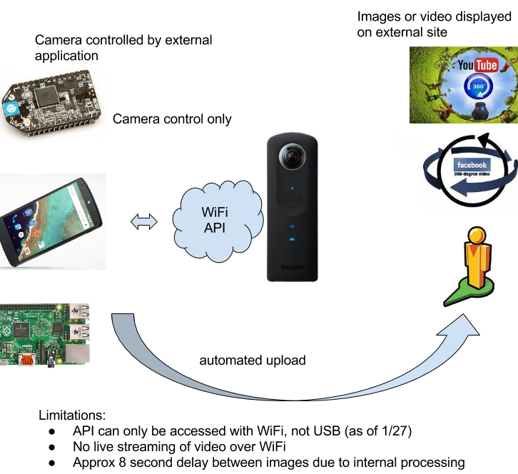
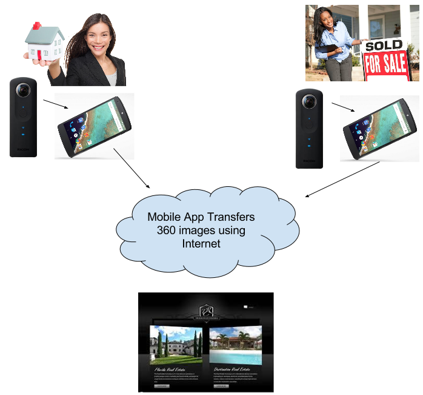
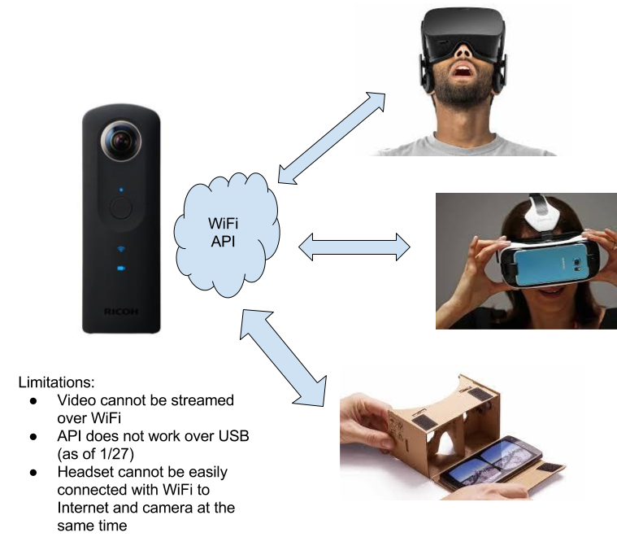

= http://theta360developers.github.io/[THETA Developers]
:icons: font
:toc: right
:toclevels: 2
:toc-title: Contents
:sectnums:

image::img/guide/logo.png[THETA DEVELOPERS UNOFFICIAL GUIDE]

Send comments and corrections to <ricohtheta360@oppkey.com>

This is an unofficial, community-generated guide for developing applications
that use 360 media from RICOH THETA cameras.
This is not authorized by RICOH and is based on publicly available information.

== Decide on Type of Application
An application for the RICOH THETA can focus on any of these categories.

* Network control of the camera
** Example: build a hardware remote to set a timer, use a small hardware device to
add GPS information or other tags
* Back-end management of media for use with third-party front-end
viewers or other existing software
** Example: build a web front-end using HoloBuilder, Pano2VR, or any number of tools to create buttons
in the spheres or navigate through the images. Create the back-end to yourself to
capture media from distributed real estate agents, security cameras, or cameras at
sporting events. The media also works with Facebook, YouTube, Google+, and
Google Streetview. So, it's possible that the back-end application could
manage the media for upload to one of these services for use in social media
campaigns or event promotion.  For example, the camera could be distributed
to influencers at an event like the dance party opening and a special platform could
aggregate and create 360 experiences using an existing front-end system.
* Viewing and then controlling the 360 degree media with an application you build
yourself. A common example is to view 360 images in a headset as part of
an immersive experience. The official RICOH THETA SDK has examples for Android and iOS to
both view and navigate spherical images. There are also examples of viewing applications
on the Unofficial RICOH GitHub repository.

=== Ideas for Apps to Control the Camera
There's many types of applications you can build to control the camera. If you're
just getting started with 360 images, I recommend you focus on building
an application to control the camera. You can extend the application to move
media from the camera to an external storage device for processing later or
to a third-party site such as YouTube, Facebook, or Google+.

Here are some ideas from the community.

* *Security*: Take 360 images (not video) at set intervals. Transfer
images from camera to external storage device. The image is already in
equirectangular format. Apply your own algorithm to identify objects.
** Key APIs: https://developers.theta360.com/en/docs/v2/api_reference/commands/camera.take_picture.html[`camera.takePicture`],
https://developers.theta360.com/en/docs/v2/api_reference/commands/camera.list_images.html[`camera.listImages`],
https://developers.theta360.com/en/docs/v2/api_reference/commands/camera.get_image.html[`camera.getImage`],
https://developers.theta360.com/en/docs/v2/api_reference/options/remaining_pictures.html[`remainingPictures`]

* *Accident*: Attach THETA to a camera platform
rigged to a commercial truck or a sign post near a dangerous crossing
such as a train crossing.
In the event of a traffic accident, a 360 degree image taken.

* *Historical Site*: Use a drone or autonomous vehicle to
take images of sites and apply tagging.

* *Additional Functionality*
** Add a timer delay to the camera
** Create a remote control feature
** Take four images at once using four cameras and four small devices like
a Raspberry Pi, each with a WiFi USB adapter. Trigger the images
simultaneously using the GPIO pins of the Pi.

=== Ideas for Back-end Server
In this scenario, you build a web site that hosts 360 images or video.
You then build a mobile app that connects to THETA and takes the image
and uploads it to your special server. Example uses are real estate,
sporting event, music festival, travel.

IMPORTANT: The mobile app will not be able to connect to the
THETA and Internet WiFi at the same time. You may need to
disconnect the phone to THETA connection before connecting
to the Internet.

NOTE: The THETA becomes a WiFi server with IP address
192.168.1.1 The IP address is not designed to be changed.

If your application has a mobile component, you should download the
https://developers.theta360.com/en/docs/sdk/[official RICOH SDK]
for Android or iOS applications.

You can extend this concept to make the images or video viewable
inside of headset for an immersive experience. The easiest way to
get a demo with 360 video up and running is to use an existing
application such as YouTube to display the media.

If you want to embed a 360 image into your web application, you can look
at one of these existing applications:

* http://ggnome.com/pano2vr[Pano2VR]: Commerical. Pano2VR is an application to convert
spherical or cylindrical panoramic images into HTML5,
Flash, or QuickTime VR (QTVR) panoramas with features such as customizable
skins, tour building, multiresolution (gigapixel panorama), hotspots
and directional sound. There is a demo available. The image with the
demo will have a watermark.
* https://www.holobuilder.com/index.html[HoloBuilder]: Free.
HoloBuilder is a f
ree web platform that lets you create 360° and virtual reality content.
Build virtual tours from your 360° photospheres and enhance them with 3D objects.
Embed images right into your website using holo player.
Based on WebGL, HoloBuilder runs on any modern web browser on any device.
HoloBuilder was the RICOH THETA developer content grand prize winner.
The application is free to use.
* http://krpano.com/[krpano]: Commercial.
Viewer for panoramic images and interactive
virtual tours. The viewer is available as Flash and HTML5 application.
The viewer is designed for the usage inside the Browser on Desktop
(Windows, Mac, Linux) and on Mobiles/Tablets (iPhone, iPad, Android, ...).
In addition to the krpano Viewer there are the krpano Tools - small tools
and droplets which help to prepare the panoramic images for viewing
and make them ready-to-use. Making a pano or a tour is possible just
by drag-and-drop. Commercial product. Demo available.

=== Ideas for VR Headsets

The THETA cannot stream video over WiFi. You can use

https://developers.theta360.com/en/docs/v2/api_reference/commands/camera._get_live_preview.html[`camera._getLivePreview`]
to get a live view. This only works in still image capture mode, not video mode.

You can use
https://developers.theta360.com/en/docs/v2/api_reference/commands/camera.take_picture.html[`camera.takePicture`] to
take the picture and
https://developers.theta360.com/en/docs/v2/api_reference/commands/camera.get_image.html[`camera.getImage`] to
transfer the image from the camera to the headset.

In most cases, the headset will be a mobile phone that is inside of a cardboard
holder. If you're targeting a mobile phone, you can use the examples in the
official https://developers.theta360.com/en/docs/sdk/[RICOH SDK].

IMPORTANT: In most cases, your application should target a still image.
Although the THETA can stream live video from the camera's USB port,
the output is in dual-fisheye mode (two spheres). Desktop software
on Mac or PC can stitch the dual-fisheye videos into equirectangular
format so that it can be viewed on the mobile phone. This is a manual
process and the video is saved to disk.
You could build a mobile app that displays a catalog of
pre-recorded videos for display in a headset.

NOTE: At CES, RICOH demonstrated live streaming of stiched video.
This software is not yet available for public use (as of 1/27).
RICOH is not able to disclose lens distortion data.

== https://developers.theta360.com/en/docs/sdk/[The Official SDK]
If you're building a mobile app or using Java, you should definitely
download and study the official SDK.

The easiest place to get started is to look at the `network` section of the SDK.
For Android, the docs are in:

  RICOH_THETA_v2_SDK_for_Android.0.1.0/RICOH_THETA_v2_SDK_for_Android.0.1.0/ricoh-theta-sample-for-androidv2/doc/index.html

Here's a taste of what the SDK offers for controlling the camera.

  ImageData getImage(java.lang.String fileId, HttpDownloadListener listener)
  Acquire raw data of specified image

  ImageSize getImageSize()
  Acquire currently set shooting size

  java.util.ArrayList<ImageInfo> getList()
  Acquire list of media files on device

  private java.util.ArrayList<ImageInfo> getListInternal(int maxReceiveEntry, java.lang.String token)
  Acquire media file list (limited number of items)

  java.io.InputStream getLivePreview()
  Acquire live view stream

  private java.lang.String getState()
  Acquire device status

  StorageInfo getStorageInfo()
  Acquire storage information of device

  Bitmap getThumb(java.lang.String fileId)
  Acquire thumbnail image

Hopefully, at this stage I've enticed you to open up the official SDK and
see if it meets your needs.

The SDK covers display and navigation of media. It does not cover video
streaming.

== Getting to Know the API
There are two versions of the THETA API. Version 1 works with m15 cameras.
Version 2 works with the THETA S. It is an HTTP API that is compliant
with the Open Spherical Camera API. You should focus on the v2 API.

The https://developers.theta360.com/en/docs/v2/api_reference/[official documentation is here].

The API only works over WiFi. As of 1/27, use of the API over USB is not
supported.

If you are new to the RICOH API, we've produced a gentle introduction.

* http://codetricity.github.io/theta-s/[THETA Developers Unofficial API Guide]

== Working with 360 Degree Media
The https://developers.theta360.com/en/docs/sdk/[official RICOH SDK] is a
great place to start to understand how to
work with 360 degree media.

To help get started, we've also started collecting community information in
an unofficial media guide.

* http://theta360developers.github.io/community-document/community.html[THETA Developers Unofficial Media Guide]
